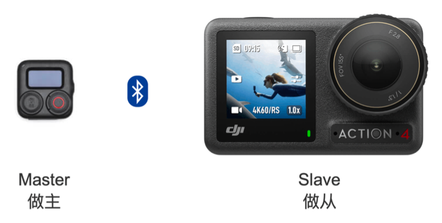
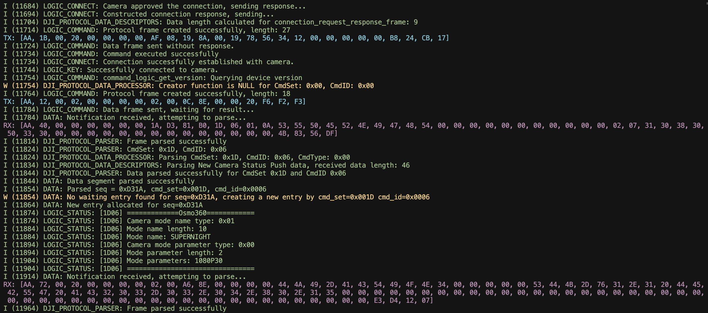

# 快速接入指南

> 本指南面向第一次使用本 Demo、且不具备蓝牙开发经验的用户。
> 按照本文档，您可以从零开始完成硬件连接、软件配置，并成功将蓝牙遥控器与相机建立连接并传输数据。

## 1. 业务背景

以 DJI 发布的 Osmo Action GPS 蓝牙遥控器为参考，该配件可与 DJI Osmo Action 6 / 5 Pro / 4 及 Osmo 360 等设备进行蓝牙连接，实现对相机的交互式控制。用户不仅可以通过遥控器向相机发送各类控制指令，还能实时获取相机的状态信息，从而获得流畅便捷的操控体验。由于 Osmo 系列相机本身不具备 GPS 模块，遥控器可将实时 GPS 数据推送至相机，进而启用 DJI Mimo APP 中的仪表盘功能，为用户带来如同 “速度与激情” 般的沉浸式使用体验。

为了进一步拓展这一能力，我们计划将其应用到更多便携式设备，例如智能手表。因此，我们推出了 [Osmo-GPS-Controller-Demo](https://github.com/dji-sdk/Osmo-GPS-Controller-Demo)，提供完整的文档与示例代码，帮助开发者快速集成相关功能，共同丰富和完善 DJI Osmo 生态。

## 2. 如何与相机交互

遥控器与相机之间的通信基于低功耗蓝牙（BLE）实现。需要明确的是，在该通信架构中，蓝牙遥控器作为主设备（Master），Osmo 相机作为从设备（Slave），双方依此模式进行协议交互，如下图所示。



蓝牙遥控器的基本连接业务流程如下：

* **扫描设备**：遥控器扫描周边蓝牙广播，寻找信号强度最高且支持 **开源协议** 的 DJI Osmo 设备。

* **建立连接**：发现目标设备后发起连接请求；相机同意连接后，完成配对与连接建立。

* **订阅状态**：连接成功后，遥控器订阅相机的状态信息，以便实时获取工作状态。

* **交互操作**：基于已建立的连接，执行拍摄、录像、模式切换、休眠、唤醒、GPS 推送等交互指令。

我们以 **建立连接** 为切入点，帮助你快速对整个开源 Demo 形成整体认识：

* 首先，所用到的 **开源协议** 即 **DJI R SDK** 协议，详细说明请参阅：[协议解析说明文档](./protocol_CN.md)。

* 有关建立连接的详细说明，请参阅：[DATA 数据段详细文档](./protocol_data_segment_CN.md) 中的 **连接请求（0019）** 命令集。

* 如需参考 Demo 的代码实现，请先完整阅读 [Demo README 文档](../README_CN.md)，熟悉硬件连线图和代码结构，然后查看 `connect_logic.c` 文件。

当你阅读完上述文档后，便已对整体业务流程和协议有了基本了解，接下来即可进入代码开发阶段。

## 3. 如何进行代码开发

由于交互过程基于蓝牙 BLE 实现，因此开发本质上就是进行 BLE 应用开发。你可以使用不同的编程语言，例如 Python、JavaScript 或 C，且 BLE 在各个平台上均有相应的跨平台支持库。

[Osmo-GPS-Controller-Demo](https://github.com/dji-sdk/Osmo-GPS-Controller-Demo) 基于 ESP32-C6 开发板，使用 C 语言编写。我们建议你在其他平台开展蓝牙遥控器开发之前，先运行并熟悉该 Demo，这将有助于后续的相机调试与测试工作。

在开发过程中，建议你将代码按业务逻辑进行分层，例如在 Demo 中划分为 **ble**、**protocol**、**data**、**logic** 等模块，以便后续扩展新的命令集或遥控器功能。

下文将展示开发思路，并对部分关键点进行提示，供参考。

### 3.1 BLE 连接逻辑开发

主要涉及：搜索广播、BLE 连接、回调通知处理等逻辑。

关键点 1：如何识别 DJI 的相机广播？当厂商字段的第 0、1 和 4 字节分别为 0xAA、0x08 和 0xFA 时，表示该相机为支持设备。可以参考 `ble.c` 的 **bsp_link_is_dji_camera_adv** 函数。

关键点 2：在进行蓝牙开发时，需要先明确目标设备的通信特征值。Osmo 相机约定的特征值如下：

| **特性** | **说明**                           |
| -------- | ---------------------------------- |
| 0xFFF4   | 相机发送，遥控器接收，需要使能通知 |
| 0xFFF5   | 相机接收，遥控器发送               |

参考代码：

```c
/* 这里定义想要过滤的 Service/Characteristic UUID，供搜索使用 */
#define REMOTE_TARGET_SERVICE_UUID   0xFFF0
#define REMOTE_NOTIFY_CHAR_UUID      0xFFF4
#define REMOTE_WRITE_CHAR_UUID       0xFFF5
```

连接建立后，仅需处理以 `0xAA` 开头的帧（DJI R SDK Protocol），其他广播数据可直接忽略。

BLE 层建立连接后，实际上相机的通信信道已被占用，其他设备将无法再通过 BLE 连接。随后，需要通过 DJI R SDK 协议完成鉴权连接，才能与相机进行交互。

### 3.2 Protocol 协议解析开发

主要涉及：DJI R SDK 协议帧的解析与封装，需要提前阅读 [协议解析说明文档](./protocol_CN.md) 和 [DATA 数据段详细文档](./protocol_data_segment_CN.md)。

在前文中，你已了解 DJI R SDK 协议的基本结构。接下来，需要基于其帧格式编写解析与封装函数。可参考 Demo 中的现有代码：

```
protocol/
├── dji_protocol_data_descriptors.c
├── dji_protocol_data_descriptors.h
├── dji_protocol_data_processor.c
├── dji_protocol_data_processor.h
├── dji_protocol_data_structures.c
├── dji_protocol_data_structures.h
├── dji_protocol_parser.c
└── dji_protocol_parser.h
```

### 3.3 Data 数据层开发

主要涉及：调用 BLE 层进行帧数据的发送与接收、调用 Protocol 层完成协议帧的封装与解析。

Data 数据层承接上层业务逻辑，负责向下层写入数据以及将接收的数据传递给上层，在整个架构中至关重要。Demo 中的数据层在有限的开发板内存中，实现了基于 SEQ 序列号或 Cmd 命令集的数据暂存机制，并向上层提供写入与读取接口，使上层能够在对 BLE 细节无感知的情况下开展开发，类似于后端开发中 DAO 层对数据库的操作。

可以参考 [数据层说明文档](./data_layer_CN.md) 和 `data.c` 代码文件。

### 3.4 Logic 逻辑层开发

主要涉及：编写各类遥控器业务逻辑代码，例如按钮事件处理、指示灯控制，以及相机功能操控（拍摄、录像、模式切换、休眠、唤醒、GPS 推送等）。

Demo 已集成部分基础逻辑功能，包括长按按钮连接相机、单击按钮进行拍摄或录像、订阅相机状态等。相关实现可参考 `logic` 文件夹下的代码。

### 3.5 开发过程小结

通过分层设计，实现了各模块的解耦，为后续功能扩展提供了便利。当代码按上述层次开发完成后，若需快速添加新功能，可参考：[添加相机休眠功能-示例文档](./add_camera_sleep_feature_example_CN.md)

## 4. 开发过程遇到问题如何解决

首先，请详细阅读 [本 Demo 的常见问题与解答](./Q&A_CN.md)，确认遇到的问题是否已有对应解决方案。

**相机推送值相关问题**：请运行本 Demo 或进行抓包，获取对应的协议帧后自行分析。下图为 Demo 的日志输出示例，其中 **TX** 表示发送给相机的数据帧，**RX** 表示相机发送给遥控器的数据帧，帧解析流程及相机状态一目了然。



如果发现协议文档与相机实际推送的数据表现存在差异，这属于正常情况。建议将问题反馈给 DJI 人员，以确认是文档描述有误，还是相机固件存在缺陷。

## 5. 所有文档汇总参考

### 5.1 协议文档

[协议解析说明文档](./protocol_CN.md)：快速了解 DJI R SDK 协议的基本组成

[DATA 数据段详细文档](./protocol_data_segment_CN.md)：详解相机支持的各类命令及功能

### 5.2 开源 Demo 文档

[Demo README 文档](../README_CN.md)：介绍整个开源 Demo 的背景与结构

[数据层说明文档](./data_layer_CN.md)：数据层的设计原理与实现细节，供开发参考

[添加相机休眠功能-示例文档](./add_camera_sleep_feature_example_CN.md)：演示如何为遥控器快速添加一个新的控制功能

[本 Demo 的常见问题与解答](./Q&A_CN.md)：解答开发过程中可能遇到的一些常见问题

### 5.3 外部参考文档

**ESP-IDF**：[ESP-IDF 官方 GitHub 仓库](https://github.com/espressif/esp-idf/)

**LC76G GNSS Module**：[LC76G GNSS Module - Waveshare Wiki](https://www.waveshare.net/wiki/LC76G_GPS_Module)

**ESP32-C6-WROOM-1**：[ESP32-C6-DevKitC-1 v1.2 - ESP32-C6 用户指南](https://docs.espressif.com/projects/esp-dev-kits/zh_CN/latest/esp32c6/esp32-c6-devkitc-1/user_guide.html)