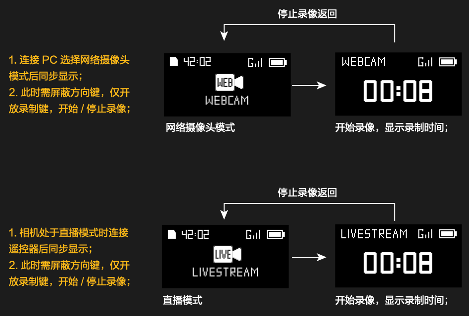

# DATA Segment Documentation

## Device ID and Common Return Codes

Used to distinguish camera models. The device ID is included when the camera actively sends the connection request result via Bluetooth:

| Model             | device_id |
| ----------------- | --------- |
| Osmo Action 4     | 0xFF33    |
| Osmo Action 5 Pro | 0xFF44    |

Common Return Codes:

| Code Value | Meaning                       |
| ---------- | ----------------------------- |
| 0x00       | Command executed successfully |
| 0x01       | Command parsing error         |
| 0x02       | Command execution failed      |
| 0xFF       | Undefined error               |

## Connection Request (0019)

CmdSet = 0x00, CmdID = 0x19

| Frame Type    | Offset | Size | Name         | Type       | Description                                                  |
| ------------- | ------ | ---- | ------------ | ---------- | ------------------------------------------------------------ |
| Command Frame | 0      | 4    | device_id    | uint32_t   | Sender's device ID                                           |
|               | 4      | 1    | mac_addr_len | uint8_t    | MAC address length                                           |
|               | 5      | 16   | mac_addr     | int8_t[16] | Sender's MAC address<br>Example: 12:33:44:55:66<br>mac_addr_len = 6<br>mac_addr[0] = 12<br>mac_addr[1] = 33<br>...<br>mac_addr[5] = 66 |
|               | 21     | 4    | fw_version   | uint32_t   | Firmware version number of the requesting device, fill in 0  |
|               | 25     | 1    | conidx       | uint8_t    | Reserved                                                     |
|               | 26     | 1    | verify_mode  | uint8_t    | 0: No verification, the camera decides based on saved history whether verification is needed, verification code carried in verify_data<br>1: Verification needed, the camera shows a verification code pop-up<br>2: Verification result, 0 allows connection, 1 rejects connection |
|               | 27     | 2    | verify_data  | uint16_t   | Verification data or code                                    |
|               | 29     | 4    | reserved     | uint8_t[4] | Reserved                                                     |

| Frame Type     | Offset | Size | Name      | Type       | Description                                                  |
| -------------- | ------ | ---- | --------- | ---------- | ------------------------------------------------------------ |
| Response Frame | 0      | 4    | device_id | uint32_t   | Device ID                                                    |
|                | 4      | 1    | ret_code  | uint8_t    | Refer to common return codes                                 |
|                | 5      | 4    | reserved  | uint8_t[4] | In the remote control, this field is used to return the camera number, used as uint32_t |

**Connection Process (Please read carefully):**

1. **Remote Control Initiates Connection Request** The remote control sends a connection request to the camera, with a random verification code in `verify_data` (this verification code matches the code on the remote control to confirm that the connection is with the current remote control). The DJI GPS Bluetooth remote control's `device_id` is: 0xFF33.

   - **First pairing**, set `verify_mode` to `1`, meaning verification is required. In this case, the camera will display a verification code pop-up, and the user needs to confirm whether to allow the connection.
   - **Already paired**, set `verify_mode` to `0`, meaning the remote control has been paired with the camera. At this point, the camera decides whether to show the pop-up based on the saved pairing history. If the camera has the pairing record saved, no pop-up will appear; if the camera has cleared the pairing information, the pop-up will show immediately.

2. **Camera Responds to Connection Request** After receiving the connection request, the camera will **immediately** respond, and the remote control will enter the state of waiting for the camera's **active** connection request.

3. **Camera Initiates Connection Request** The camera sends a connection request to the remote control, setting `verify_mode` to `2`, and `verify_data` contains the verification result:

   - `0` means the connection is allowed;
   - `1` means the connection is rejected. In this case, `device_id` contains the camera's device ID to distinguish different camera models (e.g., `Osmo Action 4`'s device ID is `0xFF33`, which is the same as the remote control's ID; this is a legacy issue).

4. **Remote Control Initiates Connection Response** If the camera allows the connection, the remote control will respond to the connection request, filling in the camera number in the `reserved` field of the response frame. The camera number is used to identify different cameras and assign an index:

   - `0` means no index added, indicating a single camera connection;
   - Positive values represent the camera number, for example, when multiple cameras are connected, the number is used to distinguish different cameras (e.g., when connecting 10 cameras, they can be assigned numbers 1~10).

   If the camera rejects the connection, immediately disconnect the Bluetooth link, and do not repeat the connection request to the rejected camera during the current pairing scan.

**Note:**

1. When the version number is `0`, the camera will not push firmware updates to the remote control.
2. Different camera models can be distinguished by `device_id`.

## Version Query (0000)

CmdSet = 0x00, CmdID = 0x00

| Frame Type    | Offset | Size | Name | Type | Description                                   |
| ------------- | ------ | ---- | ---- | ---- | --------------------------------------------- |
| Command Frame | 0      | 0    | /    | /    | No data needs to be sent in this data segment |

| Frame Type     | Offset | Size | Name        | Type        | Description                                                  |
| -------------- | ------ | ---- | ----------- | ----------- | ------------------------------------------------------------ |
| Response Frame | 0      | 2    | ack_result  | uint16_t    | Response result, refer to common return codes                |
|                | 2      | 16   | product_id  | uint8_t[16] | Product ID, e.g., DJI-RS3                                    |
|                | 18     | n    | sdk_version | uint8_t[n]  | Variable length data, divided into three parts:<br/>1) Device SDK version, e.g., SDK-V1.1<br/>2) Device name, e.g., DJI-RS3-001<br/>3) Device firmware version, e.g., 01.00.10.66 |

## Key Reporting (0011)

CmdSet = 0x00, CmdID = 0x11

| Frame Type    | Offset | Size | Name      | Type     | Description                                                  |
| ------------- | ------ | ---- | --------- | -------- | ------------------------------------------------------------ |
| Command Frame | 0      | 1    | key_code  | uint8_t  |                                                              |
|               | 1      | 1    | mode      | uint8_t  | Key report mode selection<br/>0x00: Report key press / release state<br/>0x01: Report key event |
|               | 2      | 2    | key_value | uint16_t | `mode` is 0:<br/>0x00: Key press<br/>0x01: Key release<br/>`mode` is 1:<br/>0x00: Short press event<br/>0x01: Long press event<br/>0x02: Double click event<br/>0x03: Triple click event<br/>0x04: Quadruple click event |

| Frame Type     | Offset | Size | Name        | Type    | Description                  |
| -------------- | ------ | ---- | ----------- | ------- | ---------------------------- |
| Response Frame | 0      | 1    | return code | uint8_t | Refer to common return codes |

**key_code** Explanation:

| Key Name        | Key_code | Description                                                  |
| --------------- | -------- | ------------------------------------------------------------ |
| Record Button   | 0x01     | Single press event: record                                   |
| QS Button       | 0x02     | Single press event: quick mode switch                        |
| SNAPSHOT Button | 0x03     | Single press event: quick record, the camera will automatically sleep after recording |

## Device Restart (0016)

CmdSet = 0x00, CmdID = 0x16

| Frame Type    | Offset | Size | Name      | Type       | Description |
| ------------- | ------ | ---- | --------- | ---------- | ----------- |
| Command Frame | 0      | 4    | device_id | uint32_t   | Device ID   |
|               | 4      | 4    | reserved  | uint8_t[4] | Reserved    |

| Frame Type     | Offset | Size | Name      | Type       | Description                  |
| -------------- | ------ | ---- | --------- | ---------- | ---------------------------- |
| Response Frame | 0      | 4    | device_id | uint32_t   |                              |
|                | 4      | 1    | ret_code  | uint8_t    | Refer to common return codes |
|                | 5      | 4    | reserved  | uint8_t[4] | Reserved                     |

## GPS Data Push (0017)

CmdSet = 0x00, CmdID = 0x17

| Frame Type    | Offset | Size | Name                         | Type     | Description                               |
| ------------- | ------ | ---- | ---------------------------- | -------- | ----------------------------------------- |
| Command Frame | 0      | 4    | year_month_day               | int32_t  | Date: year\*10000+month\*100+day          |
|               | 4      | 4    | hour_minute_second           | int32_t  | Time: (hour+8)\*10000+minute\*100+second  |
|               | 8      | 4    | gps_longitude                | int32_t  | Longitude value = \<actual value\> * 10^7 |
|               | 12     | 4    | gps_latitude                 | int32_t  | Latitude value = \<actual value\> * 10^7  |
|               | 16     | 4    | height                       | int32_t  | Height in mm                              |
|               | 20     | 4    | speed_to_north               | float    | Speed to the north in cm/s                |
|               | 24     | 4    | speed_to_east                | float    | Speed to the east in cm/s                 |
|               | 28     | 4    | speed_to_wnward              | float    | Descending speed in cm/s                  |
|               | 32     | 4    | vertical_accuracy_estimate   | uint32_t | Vertical accuracy estimate in mm          |
|               | 36     | 4    | horizontal_accuracy_estimate | uint32_t | Horizontal accuracy estimate in mm        |
|               | 40     | 4    | speed_accuracy_estimate      | uint32_t | Speed accuracy estimate in cm/s           |
|               | 44     | 4    | satellite_number             | uint32_t | Number of satellites                      |

| Frame Type     | Offset | Size | Name     | Type    | Description                  |
| -------------- | ------ | ---- | -------- | ------- | ---------------------------- |
| Response Frame | 0      | 1    | ret_code | uint8_t | Refer to common return codes |

The GPS command frame test data can be found in the `test_gps.c` file.

## Mode Switch (1D04)

CmdSet = 0x1D, CmdID = 0x04

| Frame Type    | Offset | Size | Name      | Type       | Description                                                  |
| ------------- | ------ | ---- | --------- | ---------- | ------------------------------------------------------------ |
| Command Frame | 0      | 4    | device_id | uint32_t   | Device ID                                                    |
|               | 4      | 1    | mode      | uint8_t    | Mode: send invalid mode when querying the mode<br/>Refer to the camera status in camera status push |
|               | 5      | 4    | reserved  | uint8_t[4] | Reserved                                                     |

| Frame Type     | Offset | Size | Name     | Type       | Description                                   |
| -------------- | ------ | ---- | -------- | ---------- | --------------------------------------------- |
| Response Frame | 0      | 1    | ret_code | uint8_t    | 0: Successful switch<br/>Non-0: Switch failed |
|                | 1      | 4    | reserved | uint8_t[4] | Reserved                                      |

For example, switching the camera to: Dynamic Time-lapse mode, the constructed DJI R SDK frame is as follows:

ByteArray: [AA, 1B, 00, 01, 00, 00, 00, 00, 00, 03, 14, BF, 1D, 04, 00, 00, FF, 33, 0A, 01, 47, 39, 36, 92, A1, 09, 55]

AA: Fixed frame header

1B 00: Since the LSB is in the first byte, it needs to be reversed, which results in 00 1B. In binary, this is 0000000000011011. According to the documentation, bits 15-10 represent the version number (000000), and bits 9-0 represent the frame length (0000011011), which corresponds to a decimal frame length of 27.

01: CmdType (00000001). According to the documentation, the 5th bit (0) indicates that the frame type is a command frame; bits 4-0 (00001) represent the response type: a response is required after data is sent, but no response is also acceptable.

00: Encryption field, 0 indicates no encryption.

00 00 00: Reserved byte segment (RES).

00 03: Sequence number (SEQ).

14 BF: CRC16 checksum of the previous data.

1D 04 / 00 00 FF 33 / 0A / 01 47 39 36: Data segment (DATA), consisting of (CmdSet, CmdID), device_id, mode, and reserved.

92 A1 09 55: CRC32 checksum of the previous data.

## Recording Control (1D03)

CmdSet = 0x1D, CmdID = 0x03

| Frame Type    | Offset | Size | Name        | Type       | Description                            |
| ------------- | ------ | ---- | ----------- | ---------- | -------------------------------------- |
| Command Frame | 0      | 4    | device_id   | uint32_t   | Device ID                              |
|               | 4      | 1    | record_ctrl | uint8_t    | 0: Start recording   1: Stop recording |
|               | 5      | 4    | reserved    | uint8_t[4] | Reserved                               |

| Frame Type     | Offset | Size | Name     | Type       | Description                  |
| -------------- | ------ | ---- | -------- | ---------- | ---------------------------- |
| Response Frame | 0      | 1    | ret_code | uint8_t    | Refer to common return codes |
|                | 1      | 4    | reserved | uint8_t[4] | Reserved                     |

## Camera Status Subscription (1D05)

CmdSet = 0x1D, CmdID = 0x05

| Frame Type    | Offset | Size | Name      | Type       | Description                                                  |
| ------------- | ------ | ---- | --------- | ---------- | ------------------------------------------------------------ |
| Command Frame | 0      | 1    | push_mode | uint8_t    | Push mode<br>0: Off<br>1: Single<br>2: Periodic<br>3: Periodic + status change push |
|               | 1      | 1    | push_freq | uint8_t    | Push frequency, unit: 0.1 Hz                                 |
|               | 2      | 4    | reserved  | uint8_t[4] | Reserved                                                     |

| Frame Type     | Offset | Size | Name | Type | Description                                      |
| -------------- | ------ | ---- | ---- | ---- | ------------------------------------------------ |
| Response Frame |        |      |      |      | Response is the camera status push command frame |

## Camera Status Push (1D02)

CmdSet = 0x1D, CmdID = 0x02

| Frame Type    | Offset | Size | Name                  | Type     | Description                                                  |
| ------------- | ------ | ---- | --------------------- | -------- | ------------------------------------------------------------ |
| Command Frame | 0      | 1    | camera_mode           | uint8_t  | Camera current mode<br/>0x00: Slow Motion<br/>0x01: Video<br/>0x02: Still Time-lapse (selectable in time-lapse photography)<br/>0x05: Photo<br/>0x0A: Dynamic Time-lapse (selectable in time-lapse photography)<br/>0x1A: Live Mode<br/>0x23: UVC Live Mode<br/>0x28: Low-light Video (Ultra Night Scene in Action 5 Pro)<br/>0x34: Human Tracking |
|               | 1      | 1    | camera_status         | uint8_t  | Camera status<br/>0x00: Screen off<br/>0x01: Live streaming<br/>0x02: Playback<br/>0x03: Recording or shooting<br/>0x05: Pre-recording |
|               | 2      | 1    | video_resolution      | uint8_t  | Camera resolution<br/>10: 1080P<br/>16: 4K 16:9<br/>45: 2.7K 16:9<br/>66: 1080P 9:16<br/>67: 2.7K 9:16<br/>95: 2.7K 4:3<br/>103: 4K 4:3<br/>Photo format (Action 5 Pro)<br/>4: L<br/>3: M |
|               | 3      | 1    | fps_idx               | uint8_t  | Camera frame rate<br/>1: 24fps<br/>2: 25fps<br/>3: 30fps<br/>4: 48fps<br/>5: 50fps<br/>6: 60fps<br/>10: 100fps<br/>7: 120fps<br/>19: 200fps<br/>8: 240fps<br/>In slow motion mode, this value indicates the slow motion multiplier, multiplier = frame rate / 30<br/>In photo mode, this value indicates burst count (1: normal photo, only one shot; >1: number of continuous shots) |
|               | 4      | 1    | EIS_mode              | uint8_t  | Camera Stabilization Mode<br/>0: Off<br/>1: RS<br/>2: HS<br/>3: +RS<br/>4: HB |
|               | 5      | 2    | record_time           | uint16_t | Current recording time, unit: seconds<br/>In burst mode, refers to burst time limit, unit: milliseconds |
|               | 7      | 1    | fov_type              | uint8_t  | FOV type, reserved                                           |
|               | 8      | 1    | photo_ratio           | uint8_t  | Photo aspect ratio<br/>0: 4:3<br/>1: 16:9                    |
|               | 9      | 2    | real_time_countdown   | uint16_t | Real-time countdown, unit: seconds                           |
|               | 11     | 2    | timelapse_interval    | uint16_t | Time-lapse video recording interval, unit: 10 seconds<br>In Time-lapse Sports mode, refers to the Sports mode magnification |
|               | 13     | 2    | timelapse_duration    | uint16_t | Time-lapse duration, unit: seconds                           |
|               | 15     | 4    | remain_capacity       | uint32_t | Remaining SD card capacity, unit: MB                         |
|               | 19     | 4    | remain_photo_num      | uint32_t | Remaining photo count                                        |
|               | 23     | 4    | remain_time           | uint32_t | Remaining recording time, unit: seconds                      |
|               | 27     | 1    | user_mode             | uint8_t  | User mode, if it is an illegal value, treat it as 0<br/>0: General mode<br/>1: Custom mode 1<br/>2: Custom mode 2<br/>3: Custom mode 3<br/>4: Custom mode 4<br/>5: Custom mode 5 |
|               | 28     | 1    | power_mode            | uint8_t  | Power mode<br/>0: Normal mode<br/>3: Sleep mode              |
|               | 29     | 1    | camera_mode_next_flag | uint8_t  | Pre-switch flag                                              |
|               | 30     | 1    | temp_over             | uint8_t  | Camera error<br/>0: Normal temperature<br/>1: Temperature warning, can record but the temperature is higher<br/>2: High temperature, cannot record<br/>3: Overheating, shutting down |
|               | 31     | 4    | photo_countdown_ms    |          | Photo countdown parameter (unit: milliseconds), remote control converts to 0.5s, 1s, 2s, 3s, 5s, 10s for display |
|               | 35     | 2    | loop_record_sends     | uint16_t | Loop recording duration (unit: seconds)<br>The remote control is switched to off, max, 5m, 20m, 1h, where off = 0<br>max = 65535 |
|               | 37     | 1    | camera_bat_percentage | uint8_t  | Battery level 0~100%                                         |

**Notes:**

1. In slow motion, the multiplier = frame rate / 30
2. In motion time-lapse, the multiplier = time-lapse recording interval
3. In static time-lapse, there is no multiplier displayed, only the interval time

**For how parameters are displayed under different camera modes and how they correspond to `camera_mode`, please refer to the following:**

* `camera_mode` = 0x00（Slow Motion）

  

* `camera_mode` = 0x01（Video）

  Video, loop recording (if the `loop_record_sends` field is not 0, loop recording is active):

  

  Pre-recording：

  

* `camera_mode` = 0x02（Still Time-lapse）

  

* `camera_mode` = 0x05（Photo）

  

  If the number of continuous shots `fps_idx` is greater than 1, it indicates burst mode is active, and the display is as follows:

  

  The L / M photo sizes are detailed in the `video_resolution` field.

* `camera_mode` = 0x0A（Dynamic Time-lapse）

  

* `camera_mode` = 0x28（Low-light Video）

  Refer to 0x01 Video Mode.

* `camera_mode` = 0x34（Human Tracking）

  Refer to 0x05 Photo Mode, but only display resolution, frame rate, and aspect ratio.

* `camera_mode` = 0x1A（Live Mode）、0x23（UVC Live Mode）

  

* When `user_mode` is not equal to 0, it indicates a custom mode.

  

## Camera Power Mode Settings (001A)

CmdSet = 0x00, CmdID = 0x1A

| Frame Type    | Offset | Size | Name       | Type    | Description                                             |
| ------------- | ------ | ---- | ---------- | ------- | ------------------------------------------------------- |
| Command Frame | 0      | 1    | power_mode | uint8_t | Power mode setting<br/>0: Normal mode<br/>3: Sleep mode |

| Frame Type     | Offset | Size | Name     | Type    | Description                  |
| -------------- | ------ | ---- | -------- | ------- | ---------------------------- |
| Response Frame | 0      | 1    | ret_code | uint8_t | Refer to common return codes |

**Question: How to wake up the camera after it enters sleep mode?**
 (The sleep mode here includes putting the camera to sleep by long-pressing the power button or using the Bluetooth remote control.)

We need to broadcast a specific data packet for 2 seconds. Refer to the following sample code:

```c
// BLE Advertising Data Format
static uint8_t adv_data[] = {
    10, 0xff, 'W','K','P','1','2','3','4','5','6'
};
```

The fields '1' to '6' represent the MAC address of the target camera device and should be written in reverse order. For detailed implementation, refer to the `ble_start_advertising` function in `ble.c`.

Once the camera enters sleep mode, it can no longer send any data, which may cause message blockage. This is important.

To use broadcast to wake up the camera, the prerequisite is that the remote controller has successfully connected to the camera within a recent period.

Broadcast Packet Reference for Osmo Action 5 Pro:


Broadcast Packet Reference for Osmo Action 4:


