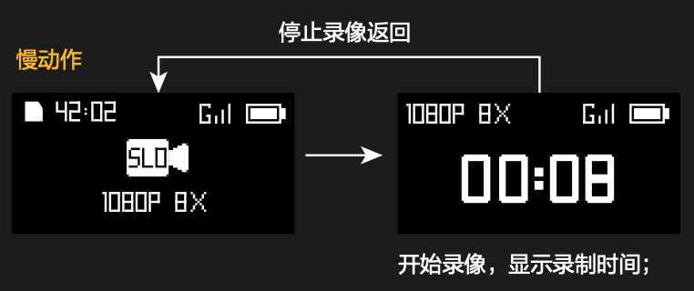
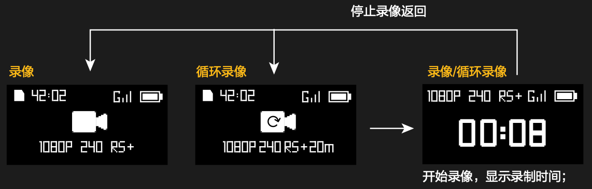
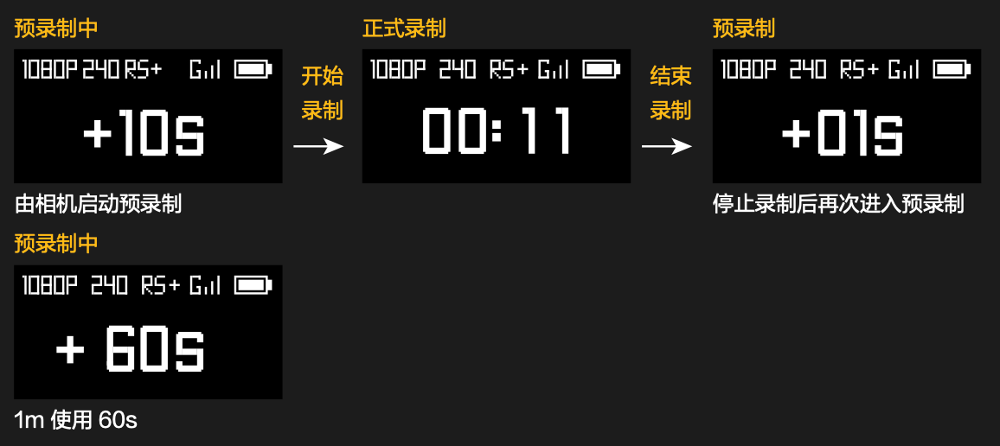
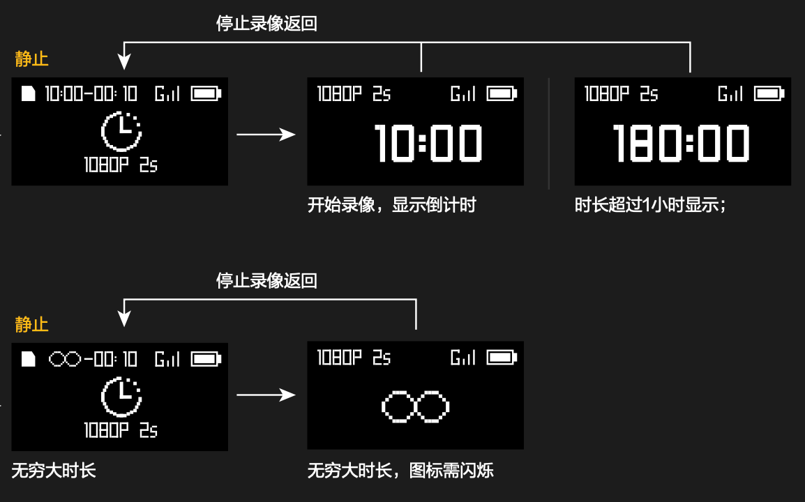
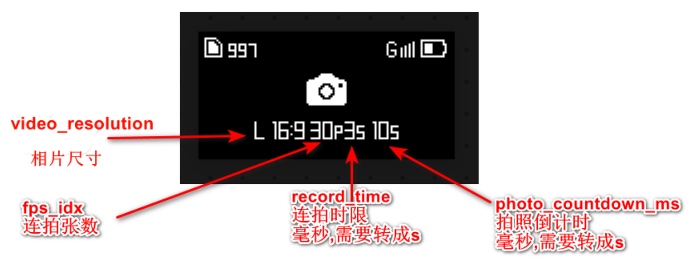
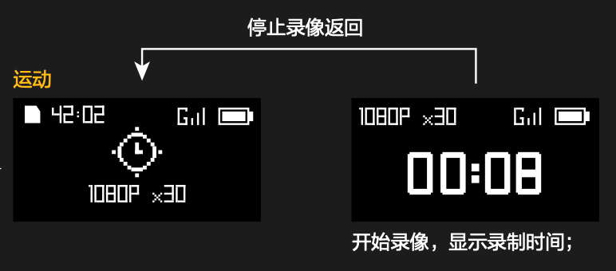
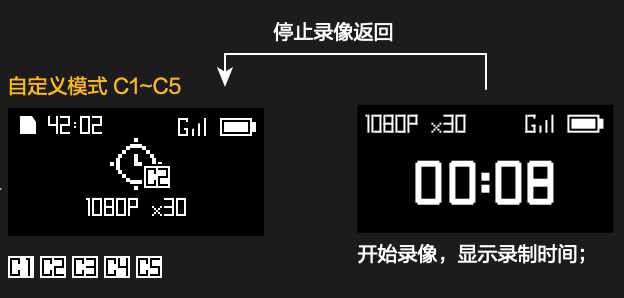
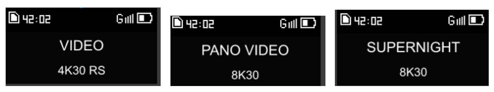

# DATA 数据段详细文档

## 设备 ID 与普通返回码

用于区分相机型号，设备 ID 在相机主动给蓝牙发送连接请求结果时会包含此 ID：

| 型号              | device_id |
| ----------------- | --------- |
| Osmo Action 4     | 0xFF33    |
| Osmo Action 5 Pro | 0xFF44    |

普通返回码：

| 码值 | 含义         |
| ---- | ------------ |
| 0x00 | 指令执行成功 |
| 0x01 | 指令解析错误 |
| 0x02 | 指令执行失败 |
| 0xFF | 未定义的错误 |

## 连接请求（0019）

CmdSet = 0x00，CmdID = 0x19

| 帧类型 | 偏移 | 大小 | 名字         | 类型       | 描述                                                         |
| ------ | ---- | ---- | ------------ | ---------- | ------------------------------------------------------------ |
| 命令帧 | 0    | 4    | device_id    | uint32_t   | 发送端的设备 ID                                              |
|        | 4    | 1    | mac_addr_len | uint8_t    | MAC 地址长度                                                 |
|        | 5    | 16   | mac_addr     | int8_t[16] | 发送端的 MAC 地址<br>MAC 地址举例：12:33:44:55:66<br>mac_addr_len = 6<br>mac_addr[0] = 12<br>mac_addr[1] = 33<br>...<br>mac_addr[5] = 66 |
|        | 21   | 4    | fw_version   | uint32_t   | 请求连接的设备的固件版本号，填写 0 即可                      |
|        | 25   | 1    | conidx       | uint8_t    | 预留                                                         |
|        | 26   | 1    | verify_mode  | uint8_t    | 0：不需要校验，相机根据自己的保存的历史判断是否需要校验，verify_data 中携带校验码<br>1：需要校验，这时候相机会弹窗，verify_data 中携带校验码<br>2：校验结果，这个是相机设备校验结果的标志，verify_data 为 0 允许连接，为 1 拒绝连接 |
|        | 27   | 2    | verify_data  | uint16_t   | 校验数据或校验码                                             |
|        | 29   | 4    | reserved     | uint8_t[4] | 预留                                                         |

| 帧类型 | 偏移 | 大小 | 名字      | 类型       | 描述                                                       |
| ------ | ---- | ---- | --------- | ---------- | ---------------------------------------------------------- |
| 应答帧 | 0    | 4    | device_id | uint32_t   | 设备 ID                                                    |
|        | 4    | 1    | ret_code  | uint8_t    | 参考普通返回码                                             |
|        | 5    | 4    | reserved  | uint8_t[4] | 在遥控器中，这个字段用于返回相机编号，当成 uint32_t 来使用 |

连接流程（请仔细阅读）：

1. **遥控器发起连接请求**
   遥控器向相机发出连接请求，`verify_data` 中包含随机校验码（该校验码与遥控器上的校验码一致，用于确认连接的是当前遥控器）。大疆 GPS 蓝牙遥控器的 `device_id` 为：0xFF33。

   - **首次配对**，`verify_mode` 应设置为 `1`，表示需要校验。在此情况下，相机会弹窗显示校验码，用户需确认是否允许连接。
   - **已经配对过**，`verify_mode` 应设置为 `0`，表示遥控器与相机已配对过。此时，相机会根据保存的配对历史来决定是否弹窗。如果相机保存了该遥控器的配对记录，则不会弹窗；如果相机已清除配对信息，则会立即弹窗。

2. **相机应答连接请求**
   相机收到连接请求后会**立即**应答，遥控器随后进入等待相机**主动**发起连接请求的状态。

3. **相机发起连接请求**
   相机向遥控器发起连接请求，`verify_mode` 设置为 `2`，`verify_data` 中的值为校验结果：

   - `0` 表示允许连接；
   - `1` 表示拒绝连接。 此时，`device_id` 中包含相机的设备 ID，用于区分不同相机型号（例如，`Osmo Action 4` 的设备 ID 为 `0xFF33`，该 ID 与遥控器的 ID 相同，这是历史遗留问题）。

4. **遥控器发起连接应答**
   如果相机允许连接，遥控器会应答连接请求，在应答包的 `reserved` 字段中填入相机编号。相机编号用于标识不同相机并为其分配下标：

   - `0` 表示不添加下标，表示单机接入；
   - 正值表示相机编号，例如，当有多台相机连接时，编号用于区分不同的相机（例如，连接了 10 台相机时，可以为它们分配编号 1~10）。

   如果相机拒绝连接，请直接切断蓝牙链路，并在当前配对扫描的过程中不再重复请求连接这台已拒绝的相机。

注意：

1. 当版本号为 `0` 时，相机不会向遥控器推送固件更新。
2. 可以通过 `device_id` 来区分不同型号的相机。
3. 第一步的连接请求命令帧，可通过 `connect_cmd_frame_builder.c` 构造并进行测试，也可直接使用已生成的部分测试帧（保存在 `connect_cmd_frame.txt` 文件中）。

## 版本号查询（0000）

CmdSet = 0x00，CmdID = 0x00

| 帧类型 | 偏移 | 大小 | 名字 | 类型 | 描述             |
| ------ | ---- | ---- | ---- | ---- | ---------------- |
| 命令帧 | 0    | 0    | /    | /    | 无需发送任何内容 |

| 帧类型 | 偏移 | 大小 | 名字        | 类型        | 描述                                                         |
| ------ | ---- | ---- | ----------- | ----------- | ------------------------------------------------------------ |
| 应答帧 | 0    | 2    | ack_result  | uint16_t    | 应答结果，参考普通返回码                                     |
|        | 2    | 16   | product_id  | uint8_t[16] | 产品的 ID，如 DJI-RS3                                        |
|        | 18   | n    | sdk_version | uint8_t[n]  | 数据不定长，分三部分<br>1) 设备端 SDK 版本号，如：SDK-V1.1<br>2) 设备名称，如：DJI-RS3-001<br>3) 设备固件版本号，如：01.00.10.66 |

## 按键上报（0011）

CmdSet = 0x00，CmdID = 0x11

| 帧类型 | 偏移 | 大小 | 名字      | 类型     | 描述                                                         |
| ------ | ---- | ---- | --------- | -------- | ------------------------------------------------------------ |
| 命令帧 | 0    | 1    | key_code  | uint8_t  | 参见下方 **key_code** 说明                                   |
|        | 1    | 1    | mode      | uint8_t  | 按键上报模式选择<br>0x00 上报按键按下 / 松开状态<br>0x01 上报按键事件 |
|        | 2    | 2    | key_value | uint16_t | `mode` 为 0 时：<br>0x00 按键按下<br>0x01 按键松开<br>`mode` 为 1 时：<br>0x00 短按事件<br>0x01 长按事件<br>0x02 双击事件<br>0x03 三击事件<br>0x04 四击事件 |

| 帧类型 | 偏移 | 大小 | 名字        | 类型    | 描述           |
| ------ | ---- | ---- | ----------- | ------- | -------------- |
| 应答帧 | 0    | 1    | return code | uint8_t | 参考普通返回码 |

**key_code** 说明：

| 按键名称          | Key_code | 说明                                                         |
| ----------------- | -------- | ------------------------------------------------------------ |
| 拍录键            | 0x01     | 单击事件：唤醒状态下拍录                                     |
| QS 键             | 0x02     | 单击事件：唤醒状态下快速模式切换，按一次切一次模式           |
| 快照键 (SNAPSHOT) | 0x03     | 单击事件：休眠状态下快速拍录，拍录完成之后，相机会自动休眠；需要先发广播唤醒流程再发此键值（广播唤醒流程详见：相机电源模式设置 001A） |

## 设备重启（0016）

CmdSet = 0x00，CmdID = 0x16

| 帧类型 | 偏移 | 大小 | 名字      | 类型       | 描述    |
| ------ | ---- | ---- | --------- | ---------- | ------- |
| 命令帧 | 0    | 4    | device_id | uint32_t   | 设备 ID |
|        | 4    | 4    | reserved  | uint8_t[4] | 预留    |

| 帧类型 | 偏移 | 大小 | 名字      | 类型       | 描述           |
| ------ | ---- | ---- | --------- | ---------- | -------------- |
| 应答帧 | 0    | 4    | device_id | uint32_t   | 设备 ID        |
|        | 4    | 1    | ret_code  | uint8_t    | 参考普通返回码 |
|        | 5    | 4    | reserved  | uint8_t[4] | 预留           |

## GPS 数据推送（0017）

CmdSet = 0x00，CmdID = 0x17

| 帧类型 | 偏移 | 大小 | 名字                         | 类型     | 描述                                         |
| ------ | ---- | ---- | ---------------------------- | -------- | -------------------------------------------- |
| 命令帧 | 0    | 4    | year_month_day               | int32_t  | 年月日<br>year\*10000+month\*100+day         |
|        | 4    | 4    | hour_minute_second           | int32_t  | 时分秒<br>(hour+8)\*10000+minute\*100+second |
|        | 8    | 4    | gps_longitude                | int32_t  | 经度 value = 实际值\*10^7                    |
|        | 12   | 4    | gps_latitude                 | int32_t  | 纬度 value = 实际值\*10^7                    |
|        | 16   | 4    | height                       | int32_t  | 高度 单位：mm                                |
|        | 20   | 4    | speed_to_north               | float    | 向北速度 单位：cm/s                          |
|        | 24   | 4    | speed_to_east                | float    | 向东速度 单位：cm/s                          |
|        | 28   | 4    | speed_to_wnward              | float    | 下降速度 单位：cm/s                          |
|        | 32   | 4    | vertical_accuracy_estimate   | uint32_t | 垂直精度估计 单位：mm                        |
|        | 36   | 4    | horizontal_accuracy_estimate | uint32_t | 水平精度估计 单位：mm                        |
|        | 40   | 4    | speed_accuracy_estimate      | uint32_t | 速度精度估计 单位：cm/s                      |
|        | 44   | 4    | satellite_number             | uint32_t | 卫星数量                                     |

| 帧类型 | 偏移 | 大小 | 名字     | 类型    | 描述                                 |
| ------ | ---- | ---- | -------- | ------- | ------------------------------------ |
| 应答帧 | 0    | 1    | ret_code | uint8_t | 参考普通返回码<br>这个应答可以不需要 |

GPS 命令帧测试数据可以参考 `test_gps.c` 文件。

## 统一模式切换（1D04）

CmdSet = 0x1D，CmdID = 0x04

| 帧类型 | 偏移 | 大小 | 名字      | 类型       | 描述                                          |
| ------ | ---- | ---- | --------- | ---------- | --------------------------------------------- |
| 命令帧 | 0    | 4    | device_id | uint32_t   | 设备 ID                                       |
|        | 4    | 1    | mode      | uint8_t    | 参考相机状态推送（1D02）中的 camera_mode 字段 |
|        | 5    | 4    | reserved  | uint8_t[4] | 预留                                          |

| 帧类型 | 偏移 | 大小 | 名字     | 类型       | 预留                          |
| ------ | ---- | ---- | -------- | ---------- | ----------------------------- |
| 应答帧 | 0    | 1    | ret_code | uint8_t    | 0：切换成功<br>非 0：切换失败 |
|        | 1    | 4    | reserved | uint8_t[4] | 预留                          |

**帧结构举例**：

例如，切换相机至：运动延时，构造的 DJI R SDK 协议帧如下：

ByteArray：[AA, 1B, 00, 01, 00, 00, 00, 00, 00, 03, 14, BF, 1D, 04, 00, 00, FF, 33, 0A, 01, 47, 39, 36, 92, A1, 09, 55]

AA：固定帧头

1B 00：由于 LSB in first，因此要倒转过来看，实际上是 00 1B，对应二进制 0000000000011011，根据文档，15 到 10 位为版本号（000000），9 到 0 位为帧长度（0000011011），帧长度对应的十进制为 27。

01：CmdType（00000001），根据文档，第 5 位（0）对应帧类型为命令帧；4 到 0 位为应答类型（00001）：数据发送之后需要应答，但是不应答也没关系。

00：加密字段，0 代表不加密

00 00 00：RES 保留字节段

00 03：SEQ 序列号

14 BF：前面数据的 CRC16 校验值

1D 04 / 00 00 FF 33 / 0A / 01 47 39 36：DATA 数据段，分别是 (CmdSet，CmdID)，device_id，mode，reserved

92 A1 09 55：前面数据的 CRC32 校验值

## 拍录控制（1D03）

CmdSet = 0x1D，CmdID = 0x03

| 帧类型 | 偏移 | 大小 | 名字        | 类型       | 描述                       |
| ------ | ---- | ---- | ----------- | ---------- | -------------------------- |
| 命令帧 | 0    | 4    | device_id   | uint32_t   | 设备 ID                    |
|        | 4    | 1    | record_ctrl | uint8_t    | 0：开始拍录<br>1：停止拍录 |
|        | 5    | 4    | reserved    | uint8_t[4] | 预留                       |

| 帧类型 | 偏移 | 大小 | 名字     | 类型       | 描述           |
| ------ | ---- | ---- | -------- | ---------- | -------------- |
| 应答帧 | 0    | 1    | ret_code | uint8_t    | 参考普通返回码 |
|        | 1    | 4    | reserved | uint8_t[4] | 预留           |

## 相机状态订阅（1D05）

CmdSet = 0x1D，CmdID = 0x05

| 帧类型 | 偏移 | 大小 | 名字      | 类型       | 描述                                                         |
| ------ | ---- | ---- | --------- | ---------- | ------------------------------------------------------------ |
| 命令帧 | 0    | 1    | push_mode | uint8_t    | 推送模式<br>0：关闭<br>1：单次<br>2：周期<br>3：周期 + 状态变化后推送一次 |
|        | 1    | 1    | push_freq | uint8_t    | 推送频率，单位 0.1 Hz；这里只能填 20，固定频率为 2Hz，不可调整 |
|        | 2    | 4    | reserved  | uint8_t[4] | 预留                                                         |

| 帧类型 | 偏移 | 大小 | 名字 | 类型 | 描述                           |
| ------ | ---- | ---- | ---- | ---- | ------------------------------ |
| 应答帧 |      |      |      |      | 参考相机状态推送（1D02）命令帧 |

## 相机状态推送（1D02）

CmdSet = 0x1D，CmdID = 0x02

| 帧类型 | 偏移 | 大小 | 名字                  | 类型     | 描述                                                         |
| ------ | ---- | ---- | --------------------- | -------- | ------------------------------------------------------------ |
| 命令帧 | 0    | 1    | camera_mode           | uint8_t  | 相机当前模式<br>0x00：慢动作<br>0x01：视频<br>0x02：静止延时（延时摄影里选择）<br>0x05：拍照<br>0x0A：运动延时（延时摄影里选择）<br>0x1A：直播<br>0x23：UVC 直播<br>0x28：低光视频（Osmo Action 5 Pro 中为超级夜景）<br>0x34：人物跟随<br>其它值：使用新协议，参考 **新相机状态推送（1D06）**，当相机状态变化，一条 1D02 命令后面会跟一条 1D06 命令 |
|        | 1    | 1    | camera_status         | uint8_t  | 相机状态<br>0x00：屏幕关闭<br>0x01：直播（包括亮屏未录制）<br>0x02：回放<br>0x03：拍照或录像中<br>0x05：预录制中 |
|        | 2    | 1    | video_resolution      | uint8_t  | 相机分辨率<br>10：1080P<br>16：4K 16:9<br>45：2.7K 16:9<br>66：1080P 9:16<br>67：2.7K 9:16<br>95：2.7K 4:3<br>103：4K 4:3<br>109：4K 9:16<br>拍照画幅（Osmo Action）<br>4：L<br>3：M<br>拍照画幅（Osmo 360）<br>4：Ultra Wide 30MP<br>3：Wide 20MP<br>2：Standard 12MP |
|        | 3    | 1    | fps_idx               | uint8_t  | 相机帧率<br>1：24fps<br>2：25fps<br>3：30fps<br>4：48fps<br>5：50fps<br>6：60fps<br>10：100fps<br>7：120fps<br>19：200fps<br>8：240fps<br>慢动作模式时，该值指慢动作倍率，倍率 = 帧率 / 30<br>拍照模式时，该值指连拍数（1：普通拍照 ，只拍一张；\>1：连拍张数） |
|        | 4    | 1    | EIS_mode              | uint8_t  | 相机增稳模式<br>0：关闭<br>1：RS<br>2：HS<br>3：RS+<br>4：HB |
|        | 5    | 2    | record_time           | uint16_t | 当前录像时间（包括预录制时长），单位：秒<br>连拍状态下，指连拍时限，单位：毫秒 |
|        | 7    | 1    | fov_type              | uint8_t  | FOV 类型，保留                                               |
|        | 8    | 1    | photo_ratio           | uint8_t  | 图片比例<br>0：4:3<br>1：16:9                                |
|        | 9    | 2    | real_time_countdown   | uint16_t | 实时倒计时，单位：秒                                         |
|        | 11   | 2    | timelapse_interval    | uint16_t | 在延时摄影静止模式下，指拍摄时间间隔，单位：0.1 秒（例如当间隔为 0.5 秒，这个值为 5）<br>在延时摄影运动模式下，指拍摄速率（Auto 选项下值为 0） |
|        | 13   | 2    | timelapse_duration    | uint16_t | 延时录像时长，单位：秒                                       |
|        | 15   | 4    | remain_capacity       | uint32_t | SD 卡剩余容量，单位：MB                                      |
|        | 19   | 4    | remain_photo_num      | uint32_t | 剩余拍照张数                                                 |
|        | 23   | 4    | remain_time           | uint32_t | 剩余录像时间，单位：秒                                       |
|        | 27   | 1    | user_mode             | uint8_t  | 用户模式，非法值按 0 处理<br>0：通用模式<br>1：自定义模式1<br>2：自定义模式2<br>3：自定义模式3<br>4：自定义模式4<br>5：自定义模式5 |
|        | 28   | 1    | power_mode            | uint8_t  | 电源模式<br>0：正常工作模式<br>3：休眠模式                   |
|        | 29   | 1    | camera_mode_next_flag | uint8_t  | 预切换标志<br/>在预切换（例如 QS）模式下，仅显示模式名称和图标，不展示具体参数。<br/> `camera_mode_next_flag` 表示即将切换的目标模式；若当前不处于预切换模式，则该字段表示当前模式，与 `camera_mode` 保持一致。 |
|        | 30   | 1    | temp_over             | uint8_t  | 相机发生了错误<br>0：温度正常<br>1：温度警告，可以录制但温度比较高了<br>2：温度高，不可以录制<br>3：温度过高，要关机了 |
|        | 31   | 4    | photo_countdown_ms    | uint32_t | 拍照倒计时参数（单位：毫秒）遥控器转换为 0.5s，1s，2s，3s，5s，10s 几个档显示 |
|        | 35   | 2    | loop_record_sends     | uint16_t | 循环录像时长（单位：秒）<br>遥控器转为 off，max，5m，20m，1h 几档显示，其中 off = 0<br>max = 65535 |
|        | 37   | 1    | camera_bat_percentage | uint8_t  | 电池电量 0~100%                                              |

注：

1. 慢动作下，倍率 = 帧率 / 30
2. 运动延时下，倍率 = 延时摄影录像时间间隔
3. 静止延时下，没有倍率显示，只有间隔时间

**【重点】关于不同相机模式下，UI 如何显示，如何与 `camera_mode` 对应，参考如下**：

* `camera_mode` = 0x00（慢动作）

  

* `camera_mode` = 0x01（视频）

  视频、循环录像（`loop_record_sends` 字段不为 0 就是在循环）：

  

  预录制：

  

* `camera_mode` = 0x02（静止延时）

  

* `camera_mode` = 0x05（拍照）

  

  如果连拍张数 `fps_idx` 大于 1 说明处于连拍模式，显示如下：

  

  L / M 相片尺寸详见 `video_resolution` 字段

* `camera_mode` = 0x0A（运动延时）

  

* `camera_mode` = 0x28（低光视频，超级夜景）

  参考 0x01 视频模式

* `camera_mode` = 0x34（人物跟随）

  参考 0x05 拍照模式，但只显示分辨率、帧率、比例

* `camera_mode` = 0x1A（直播）、0x23（UVC 直播）

  

* 当 `user_mode` 不等于 0，为自定义模式

  

## 新相机状态推送（1D06）

CmdSet = 0x1D，CmdID = 0x06

| 帧类型 | 偏移 | 大小 | 名字              | 类型        | 描述                                                      |
| ------ | ---- | ---- | ----------------- | ----------- | --------------------------------------------------------- |
| 命令帧 | 0    | 1    | type_mode_name    | uint8_t     | 固定为 0x01                                               |
|        | 1    | 1    | mode_name_length  | uint8_t     | 模式名字长度                                              |
|        | 2    | 20   | mode_name         | uint8_t[20] | 模式名字，ASCII码，最长不超过20字节；这个字符串要直接显示 |
|        | 22   | 1    | type_mode_param   | uint8_t     | 固定为 0x02                                               |
|        | 23   | 1    | mode_param_length | uint8_t     | 模式参数长度                                              |
|        | 24   | 20   | mode_param        | uint8_t[20] | 模式参数，ASCII 码，最长不超过20字节                      |

UI 设计参考：



## 相机电源模式设置（001A）

CmdSet = 0x00，CmdID = 0x1A

| 帧类型 | 偏移 | 大小 | 名字       | 类型    | 描述                                       |
| ------ | ---- | ---- | ---------- | ------- | ------------------------------------------ |
| 命令帧 | 0    | 1    | power_mode | uint8_t | 电源模式设置<br>0：正常模式<br>3：休眠模式 |

| 帧类型 | 偏移 | 大小 | 名字     | 类型    | 描述           |
| ------ | ---- | ---- | -------- | ------- | -------------- |
| 应答帧 | 0    | 1    | ret_code | uint8_t | 参考普通返回码 |

问题：**休眠后如何唤醒相机？**（此处的休眠包括：长按相机电源键休眠相机、使用蓝牙遥控器休眠相机）

我们需要广播一段数据 2 秒，参考代码如下：

```c
// 广播数据
static uint8_t adv_data[] = {
    10, 0xff, 'W','K','P','1','2','3','4','5','6'
};
```

其中 '1' - '6' 字段为目标相机设备的 MAC 地址，需要反过来填写，详细代码实现参考 `ble.c` 的 `ble_start_advertising` 函数。

相机状态变成休眠后，不能再发送任何数据，有可能导致消息堵塞，这很重要。

使用广播唤醒相机的前提是：遥控器在近期内曾成功连接过该相机；相机在进入休眠 30min 内可以通过广播唤醒流程唤醒，30min 后无法被蓝牙遥控器唤醒。

Osmo Action 5 Pro 广播包参考（上图为 OA5Pro 的广播，下图为蓝牙遥控器唤醒 OA5Pro 的广播）：


Osmo Action 4 广播包参考（上图为 OA4 的广播，下图为蓝牙遥控器唤醒 OA4 的广播）：


